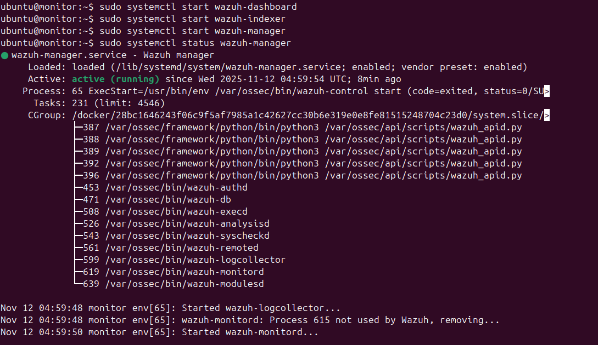
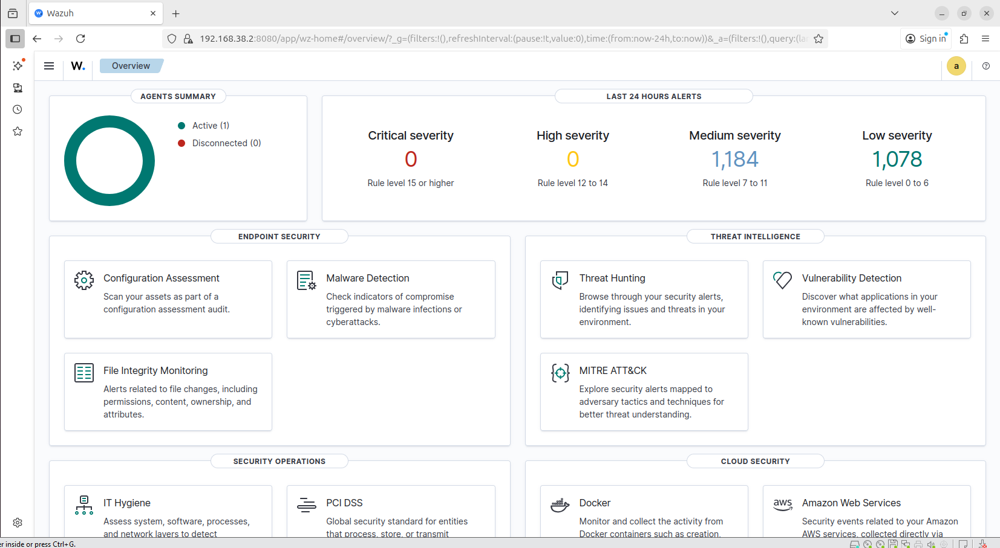
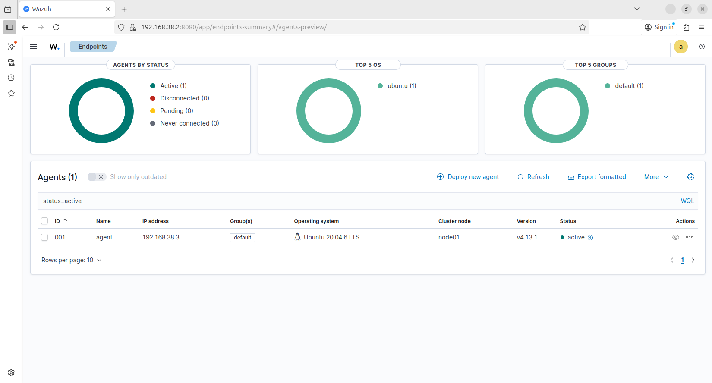
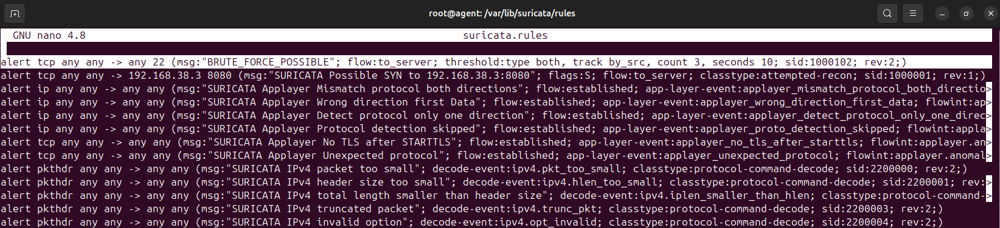
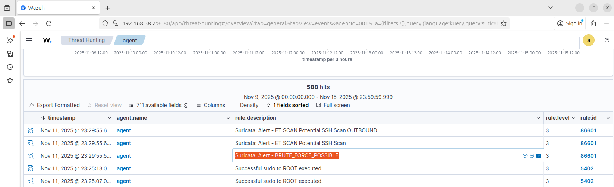

# Wazuh tích hợp Suricata 
## Nội dung : 
### 1.Cài đặt Wazuh Manager và Wazuh Agent
- **Task 1** : Wazuh Server
Trên terminal monitor thực hiện cài đặt Wazuh Server đóng vai trò trung tâm thu thập , phân tích và xử lý dữ liệu :
*`sudo apt update`*
*`sudo apt install curl -y`*
*`curl -sO https://packages.wazuh.com/4.13/wazuh-install.sh && sudo bash ./wazuh-install.sh -a -p 8080`*
Cài đặt xong sẽ xuất hiện tài khoản và mật khẩu để đăng nhập vào Wazuh
Kiểm tra trạng thái
*`systemctl status wazuh-dashboard`*
*`systemctl status wazuh-indexer`*
*`systemctl status wazuh-manager`*

Mở trình duyệt firefox và truy cập đường dẫn : *https://192.168.0.1:8080*
Tiến hành đăng nhập vào Wazuh bằng tài khoản và mật khẩu đã lấy được


- **Task 2** : Wazuh Agent
Trên terminal victim thực hiện cài đặt Wazuh Agent để giám sát các điểm cuối (endpoint) như máy chủ hoặc máy tính cá nhân, thu thập thông tin bảo mật (log, thay đổi tệp, cấu hình), phát hiện các hoạt động bất thường, lỗ hổng và mối đe dọa, sau đó gửi dữ liệu này về Wazuh Server để phân tích và xử lý :
*`sudo apt update`*
*`sudo apt install wget -y`*
*`wget https://packages.wazuh.com/4.x/apt/pool/main/w/wazuh-agent/wazuh-agent_4.13.1-1_amd64.deb && sudo WAZUH_MANAGER='victim_ip' WAZUH_AGENT_NAME='alice' dpkg -i ./wazuh-agent_4.13.1-1_amd64.deb`*
Kiểm tra phần *server* trong file , đặt lại phần địa chỉ của *Wazuh Manager* :
```html
<client>
    <server>
      <address>MANAGER.IP</address> => đặt lại địa chỉ ip Wazuh Manager
      <port>1514</port>
      <protocol>tcp</protocol>
    </server>
    <config-profile>ubuntu, ubuntu20, ubuntu20.04</config-profile>
    <notify_time>20</notify_time>
    <time-reconnect>60</time-reconnect>
    <auto_restart>yes</auto_restart>
    <crypto_method>aes</crypto_method>
  </client>

```
Tiến hành khởi chạy các dịch vụ của Wazuh Agent : 
*`sudo systemctl daemon-reload`*
*`sudo systemctl enable wazuh-agent`*
*`sudo systemctl start wazuh-agent`*
Kiểm tra lại trạng thái của wazuh-agent : 
*`sudo systemctl status wazuh-agent`*
Mở lại giao diện của Wazuh khi đó sẽ thấy 1 agent đang active 

- **Task 3** : Cài đặt suricata
Trên terminal monitor, chạy các lệnh sau để cài đặt software-properties-common - công cụ cung cấp các tiện ích quản lý repositories của apt:
*`sudo apt update`*
*`sudo apt install -y software-properties-common`*
Tiếp theo, trên terminal monitor, chạy lệnh sau để thêm repository OISF:
*`sudo add-apt-repository ppa:oisf/suricata-stable -y`*
Kiểm tra phiên bản Suricata sau khi cài đặt, xác định cài đặt thành công:
*`suricata --version`*
- **Task 4** : Tạo rule Suricata phát hiện tấn công bruteforce
Trên terminal monitor, chạy lệnh sau để cập nhật và tải folder rules mặc định của Suricata lần đầu tiên:
*`sudo suricata-update`*
Sau khi cài đặt, chạy các lệnh sau để kiểm tra xem folder rules của Suricata được tải chưa:
*`sudo su`*
*`cd /var/lib/suricata/`*
Nếu có xuất hiện folder rules là đã thành công.
Sau khi truy cập folder rules, chạy lệnh sau để mở file chứa rule mặc định của Suricata:
*`nano suricata.rules`*
Thêm rule sau vào đầu file:
*`alert tcp any any -> any 22 (msg:"BRUTE_FORCE_POSSIBLE"; flow:to_server; threshold:type both, track by_src, count 3, seconds 10; sid:1000102; rev:2;)`*

Sau khi thêm rule, thoát và lưu file. Trên máy monitor, chạy các lệnh sau để khởi động lại và kiểm tra trạng thái Suricata:
*`sudo systemctl restart suricata`*
*`sudo systemctl status suricata`*
- **Task 5** : Tích hợp Wazuh Agent và Suricata
Trên terminal agent , cấu hình *localfile* để đẩy log về Wazuh
```sudo nano /var/ossec/etc/ossec.conf```
Thêm cấu hình như sau 
```html
<localfile>
    <log_format>json</log_format>
    <location>/var/log/suricata/eve.json</location>
</localfile>
```

Khởi động lại wazuh-agent 
```sudo systemctl restart wazuh-agent```

- **Task 6** : Thử nghiệm 
Trên máy monitor và máy attacker, tiến hành chạy các lệnh sau để cài đặt ssh:
```
sudo apt update
sudo apt install ssh
sudo systemctl start ssh
```
Sau khi cài đặt, kiểm tra trạng thái hoạt động của ssh trên cả hai máy bằng lệnh sau:
```
sudo systemctl status ssh
```
Tiếp theo, trên máy attacker, chạy các lệnh sau để cài đặt công cụ hydra - giúp tiến hành tấn công brute-force thông tin đăng nhập trên máy monitor:
```
sudo apt install hydra
```
Tiếp theo, tiến hành tấn công brute-force bằng lệnh sau trên máy attacker:
```
hydra -L users.txt -P passwords.txt -t 16 -f -s 22 -V ssh://192.168.38.3
```
- **Task 7** : Kiểm tra log Suricata trên Dashboard của  Wazuh
Mở giao diện Wazuh trên trình duyệt , chọn agent đang active . Chọn Threat hunting => Event 

